# Task 4
## Java project build using Jenkins with Sonarqube, Docker deploy and Allure

В качестве собираемого приложения выбрал домашку по джаве. Контейнер с дженкинсом пришлось модифицировать чтобы там работал докер.

## Скрины:
#### Параметры Tools:
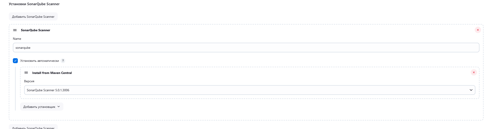
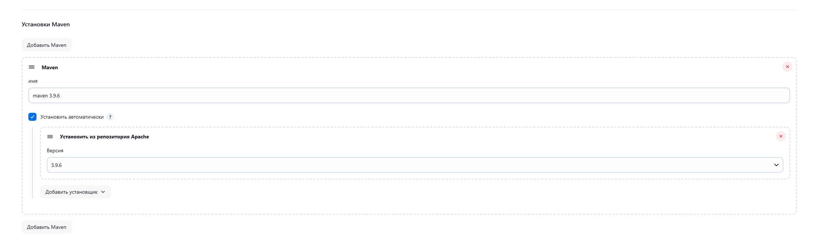
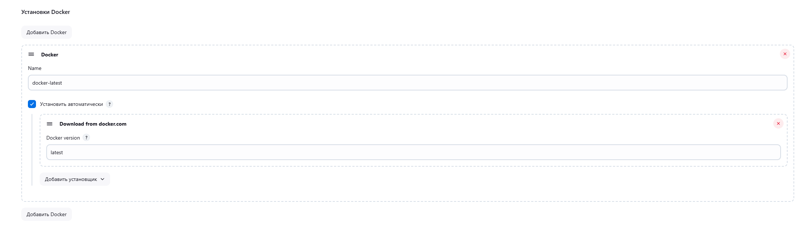
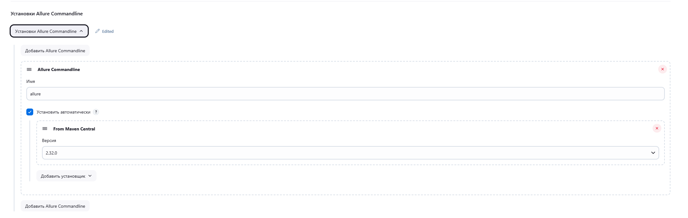

#### Параметры System:
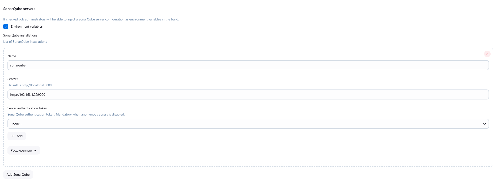

#### Параметры пайплайна:
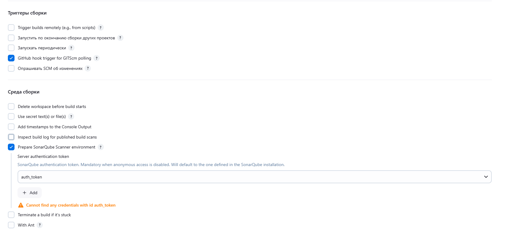
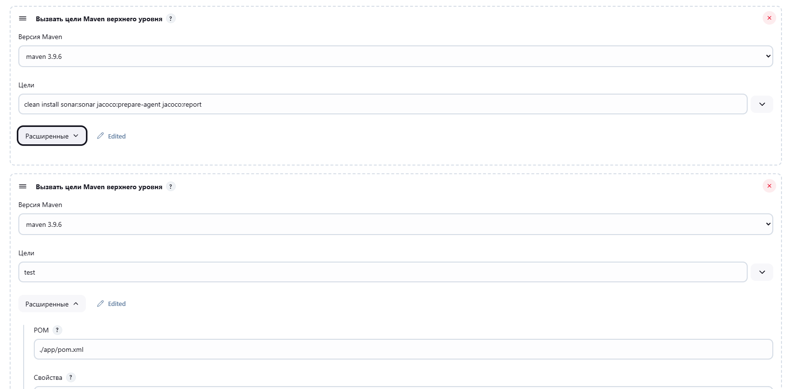
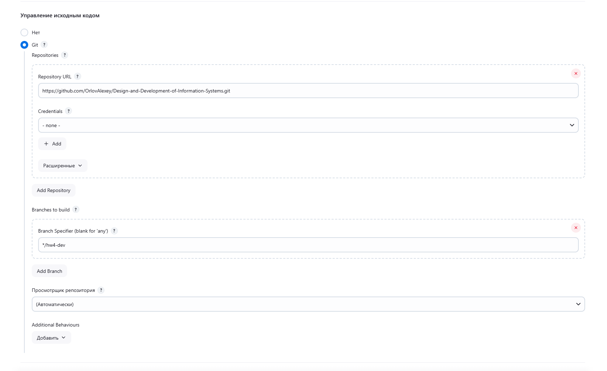
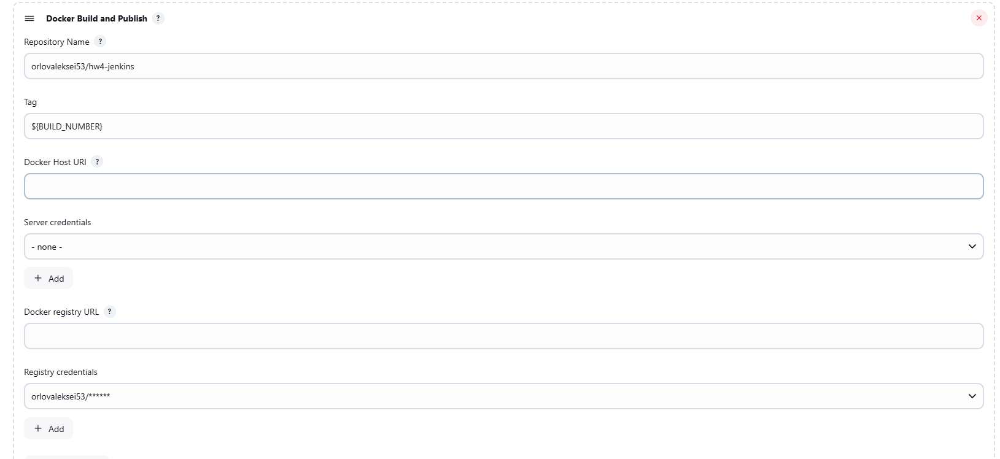
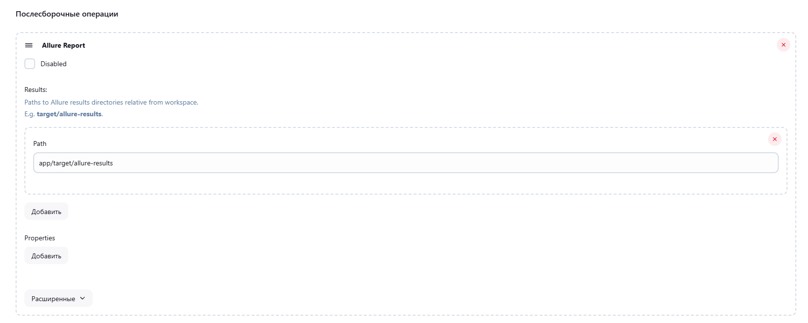

#### Лог пайплайна:
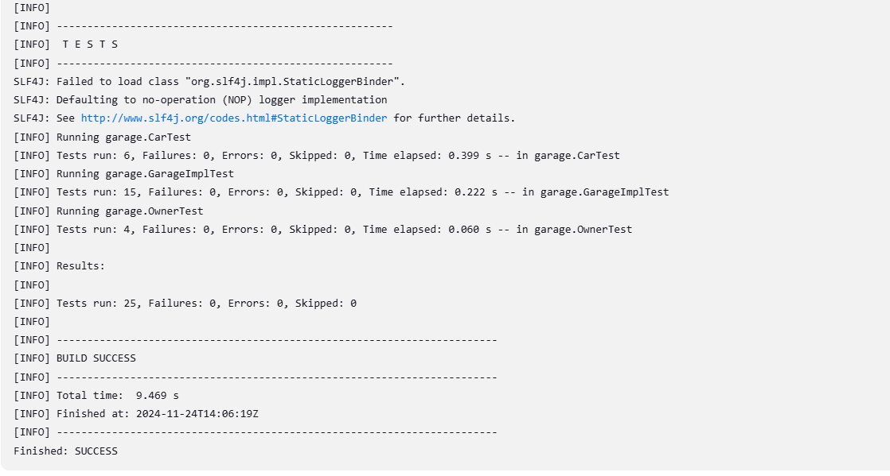
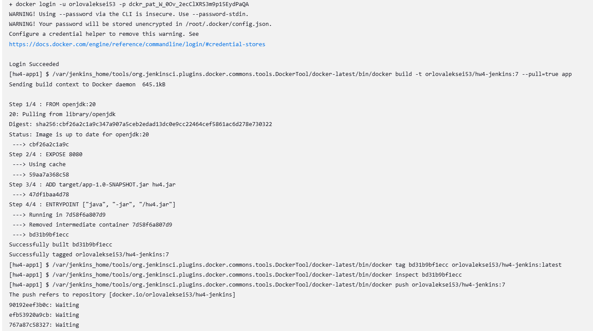
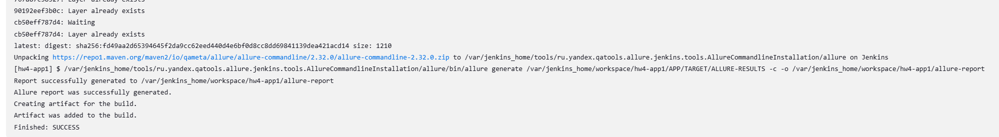

#### Результат сборки и покрытие кода:
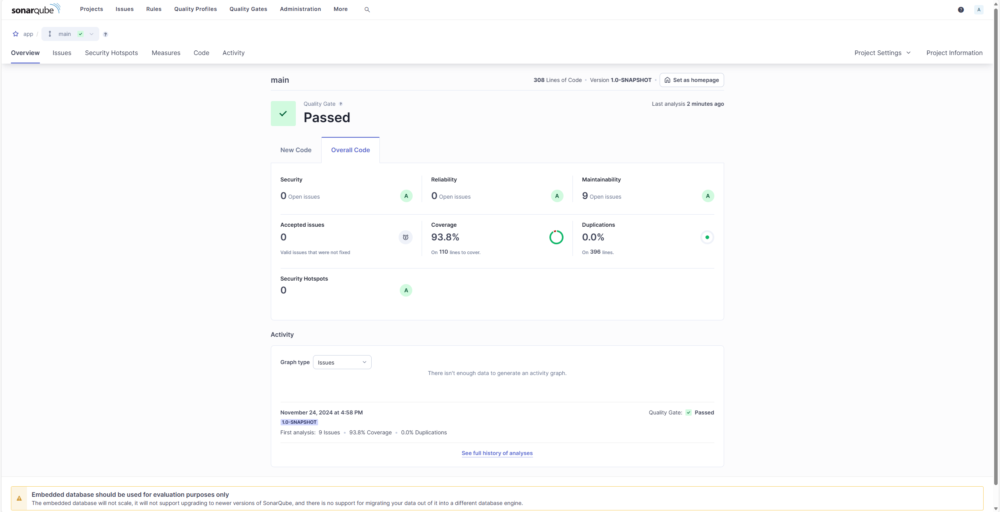
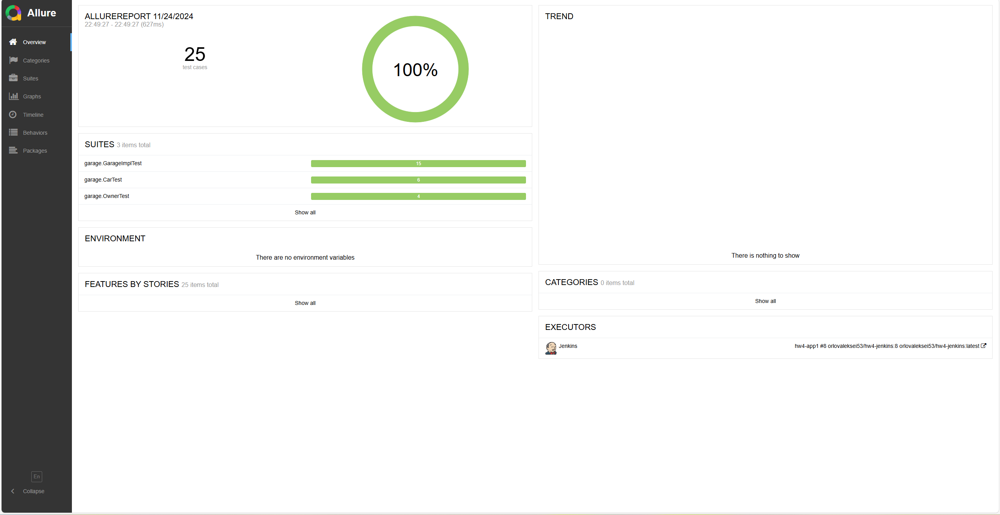
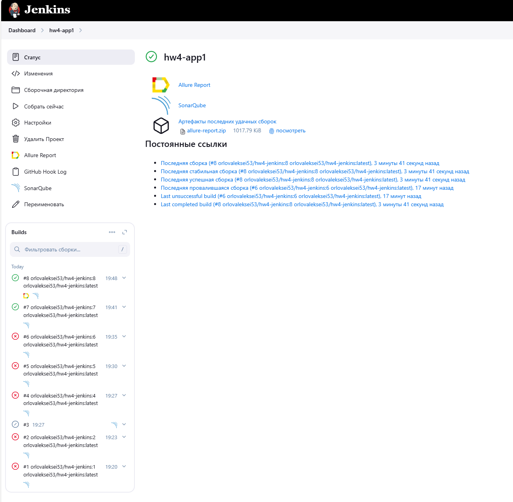