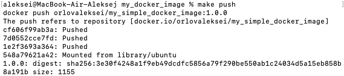

# Design-and-Development-of-Information-Systems
This repository contains homeworks for Design and Development of Information Systems in SberTech

## Задание 1

Папка `my_docker_image` \
Чтобы запустить сборки image, выполните `make build` \
Чтобы запушить готовый образ, выполните `make push` \
Чтобы запустить контейнер с готового образа, выполните `make run`

У меня не получилось залогиниться в докерхабе из-за странной ошибки, но запушить контейнер получилось \

## Задание 2
