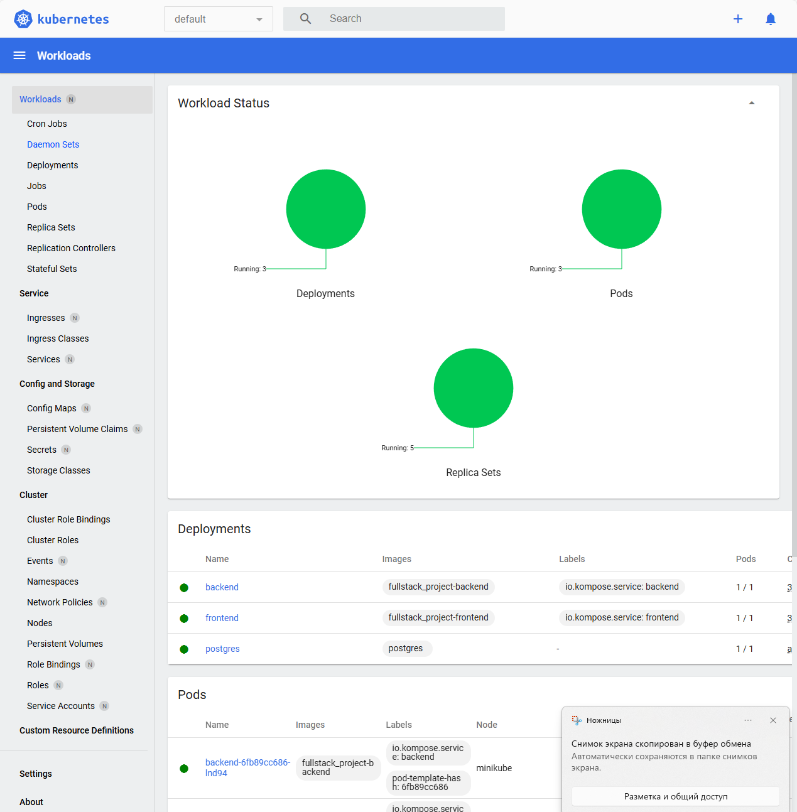

# Task 5

## kubernetes
Папка `fullstack_project` \
Перед сборкой образов лучше сделать `eval $(minikube docker-env)`, чтобы установить переменные окружения. \
Чтобы запустить сборки images, выполнить `docker-compose up` и как только образы соберутся остановить. \
Далее выполнить `minikube start && kubectl config use-context minikube`. \
Отслеживать можно в `minikube dashboard`. \
Далее запустить кубер командой `kubectl apply -f kubemanifests.yaml`. \
Также нужно прокинуть туннель `minikube tunnel`, чтобы можно было с хоста зайти постучаться. 

## Скрины
Сервисы в дашборде: 

Curl в работающее приложение:
